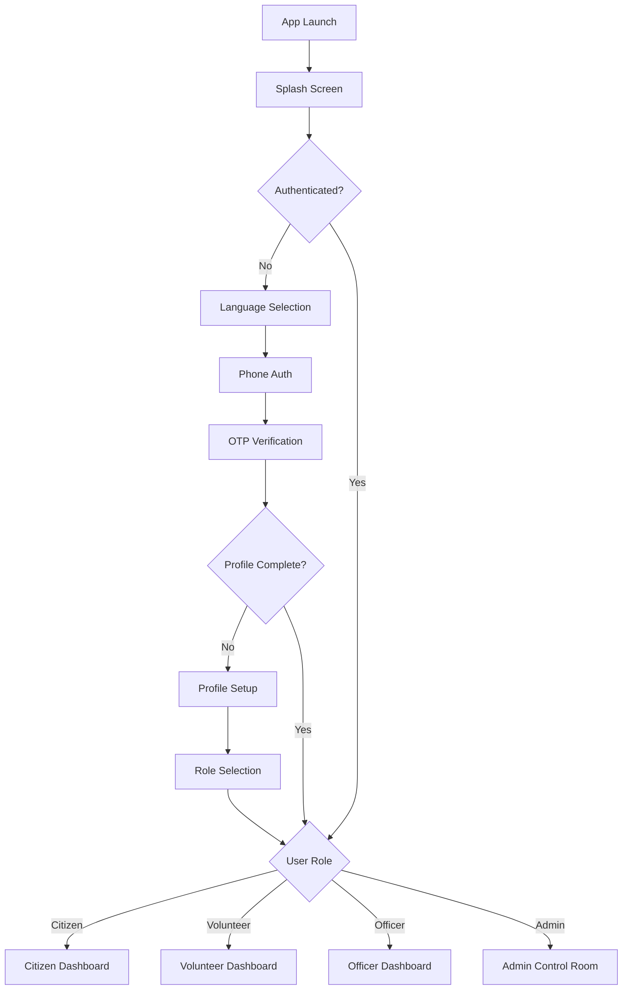

# Design Document: GramPulse Application Integration

## Overview

This design document outlines the technical approach for integrating two separate Flutter applications (grampulse-citizen and grampulse-volunteer) into a single unified GramPulse application. The integration will create a cohesive, role-based application that supports Citizens, Volunteers, Officers, and Administrators while preserving 100% of existing functionality from both source applications.

The integration follows a systematic approach: dependency resolution → project structure unification → feature module integration → navigation consolidation → testing and verification.

## Architecture

### High-Level Architecture

The unified application will follow a clean architecture pattern with feature-based organization:

```
grampulse/
├── lib/
│   ├── main.dart                    # Single entry point
│   ├── app/
│   │   ├── app.dart                 # Main app widget
│   │   └── router.dart              # Unified router with role-based navigation
│   ├── core/
│   │   ├── services/                # Shared services (API, Auth, Location)
│   │   ├── widgets/                 # Shared UI components
│   │   ├── theme/                   # Application theming
│   │   ├── constants/               # App-wide constants
│   │   └── utils/                   # Utility functions
│   ├── features/
│   │   ├── auth/                    # Shared authentication
│   │   ├── citizen/                 # Citizen-specific features
│   │   ├── volunteer/               # Volunteer-specific features
│   │   ├── officer/                 # Officer-specific features
│   │   ├── admin/                   # Admin-specific features
│   │   ├── report/                  # Shared reporting features
│   │   ├── map/                     # Shared map features
│   │   └── profile/                 # Shared profile features
│   └── l10n/                        # Localization files
├── android/                         # Merged Android configuration
├── ios/                             # Merged iOS configuration
├── web/                             # Merged Web configuration
└── pubspec.yaml                     # Unified dependencies
```

### Role-Based Navigation Flow



### State Management Architecture

The application uses the BLoC pattern for state management:

- **AuthBloc**: Manages authentication state across all roles
- **Role-Specific BLoCs**: Each feature has its own BLoCs (CitizenHomeBloc, VolunteerDashboardBloc, etc.)
- **Shared BLoCs**: Common functionality like ProfileBloc, ReportBloc, MapBloc

## Components and Interfaces

### 1. Dependency Resolution Component

**Purpose**: Merge and resolve all package dependencies from both applications.

**Strategy**:
- Use the higher compatible version when conflicts exist
- Preserve all commented-out dependencies with explanations
- Maintain dev_dependencies from both applications

**Key Dependencies to Merge**:
```yaml
# State Management: Both use flutter_bloc ^8.1.3 ✓
# Navigation: Both use go_router ^12.1.3 ✓
# Network: Citizen uses dio ^5.3.2, Volunteer uses ^5.3.3 → Use ^5.3.3
# Location: Citizen uses geolocator ^14.0.2, Volunteer uses ^10.1.0 → Use ^14.0.2
# Storage: Citizen uses shared_preferences ^2.5.3, Volunteer uses ^2.2.2 → Use ^2.5.3
# Additional from Citizen: http, url_launcher, record, flutter_tts, fl_chart, uuid
```

### 2. Project Structure Unification Component

**Purpose**: Create a single coherent directory structure.

**Approach**:
1. Use grampulse-citizen as the base (more complete implementation)
2. Add volunteer-specific features from grampulse-volunteer
3. Merge shared features (auth, citizen) intelligently

**File Merge Strategy**:
- **Identical files**: Keep one copy
- **Different implementations**: Preserve both with clear naming
- **Complementary files**: Merge content where appropriate

### 3. Authentication Integration Component

**Purpose**: Provide a unified authentication system for all roles.

**Design**:
- Single AuthBloc managing authentication state
- Single AuthService handling API calls
- Role-based routing after authentication
- Shared authentication screens (splash, language, login, OTP, profile setup, role selection)

**AuthBloc States**:
```dart
abstract class AuthState {}
class AuthInitial extends AuthState {}
class AuthLoading extends AuthState {}
class Authenticated extends AuthState {
  final User user;
  final bool isProfileComplete;
}
class Unauthenticated extends AuthState {}
class AuthError extends AuthState {
  final String message;
}
```

### 4. Router Integration Component

**Purpose**: Unified navigation supporting all four roles.

**Design**:
- Single GoRouter instance
- Role-based route guards
- Shell routes for each role (consistent navigation UI)
- Redirect logic based on authentication and role

**Route Structure**:
```
/                                    # Splash
/language-selection                  # Language selection
/login                               # Phone authentication
/otp-verification/:phoneNumber       # OTP verification
/profile-setup                       # Profile setup
/role-selection                      # Role selection

# Citizen Routes (Shell)
/citizen/home                        # Citizen dashboard
/citizen/explore                     # Explore issues
/citizen/my-reports                  # My reports
/citizen/profile                     # Profile
/citizen/report-issue                # Report new issue

# Volunteer Routes (Shell)
/volunteer/dashboard                 # Volunteer dashboard
/volunteer/verification-queue        # Verification queue
/volunteer/assist-citizen            # Assist citizen
/volunteer/performance               # Performance metrics

# Officer Routes (Shell)
/officer/dashboard                   # Officer dashboard
/officer/inbox                       # Inbox
/officer/work-orders                 # Work orders
/officer/analytics                   # Analytics

# Admin Routes (Shell)
/admin/control-room                  # Control room
/admin/department-performance        # Department performance
/admin/fund-allocation               # Fund allocation
/admin/system-configuration          # System configuration
/admin/analytics-reports             # Analytics reports
```

### 5. Feature Module Integration Component

**Purpose**: Integrate all feature modules while maintaining isolation.

**Modules**:

**auth** (Merged from both):
- Source: Primarily from grampulse-citizen (more complete)
- Add any missing screens/blocs from grampulse-volunteer
- Structure: domain/ (services, models), presentation/ (screens, blocs)

**citizen** (Merged from both):
- Source: Primarily from grampulse-citizen
- Verify grampulse-volunteer doesn't have additional citizen features
- Structure: domain/ (models, repositories), presentation/ (screens, blocs, widgets)

**volunteer** (From grampulse-citizen):
- Source: grampulse-citizen/lib/features/volunteer/
- Note: grampulse-volunteer doesn't have a volunteer feature module
- Structure: presentation/ (screens, blocs, widgets)

**officer** (From grampulse-citizen):
- Source: grampulse-citizen/lib/features/officer/
- Structure: presentation/ (screens, blocs, widgets)

**admin** (From grampulse-citizen):
- Source: grampulse-citizen/lib/features/admin/
- Structure: presentation/ (screens, blocs, widgets)

**report** (From grampulse-citizen):
- Source: grampulse-citizen/lib/features/report/
- Shared across roles
- Structure: domain/ (models), presentation/ (screens, blocs, widgets)

**map** (From grampulse-citizen):
- Source: grampulse-citizen/lib/features/map/
- Shared across roles
- Structure: domain/ (models), presentation/ (screens, blocs, widgets)

**profile** (From grampulse-citizen):
- Source: grampulse-citizen/lib/features/profile/
- Shared across roles
- Structure: data/ (models, repositories), presentation/ (screens, blocs, widgets)

### 6. Core Services Integration Component

**Purpose**: Provide shared services for all features.

**Services to Integrate**:

**ApiService**:
- Source: grampulse-citizen/lib/core/services/api_service.dart
- Handles all HTTP requests
- Includes authentication headers
- Error handling and retry logic

**AuthService**:
- Source: grampulse-citizen/lib/core/services/auth_service.dart (domain)
- Manages authentication tokens
- Handles login/logout operations
- Session management

**LocationService**:
- Source: grampulse-citizen/lib/core/services/location_service.dart
- GPS and location operations
- Permission handling

**ReportService**:
- Source: grampulse-citizen/lib/core/services/report_service.dart
- Report creation and management
- Shared across roles

### 7. Theme and UI Integration Component

**Purpose**: Unified theming and shared UI components.

**Approach**:
- Merge theme files from both applications
- Use grampulse-citizen theme as base (more complete)
- Ensure consistent styling across all roles

**Theme Structure**:
```
core/theme/
├── app_theme.dart          # Main theme configuration
├── color_schemes.dart      # Color definitions
├── text_theme.dart         # Typography
└── spacing.dart            # Spacing constants
```

**Shared Widgets**:
```
core/widgets/
├── buttons.dart            # Button components
├── cards.dart              # Card components
└── inputs.dart             # Input components
```

### 8. Localization Integration Component

**Purpose**: Merge localization files from both applications.

**Approach**:
- Merge ARB files from both applications
- Resolve duplicate keys (use more complete translation)
- Maintain support for: English, Hindi, Tamil, Malayalam, Kannada

**Structure**:
```
l10n/
├── app_localizations.dart
├── l10n.dart
└── arb/
    ├── app_en.arb
    ├── app_hi.arb
    ├── app_ta.arb
    ├── app_ml.arb
    └── app_kn.arb
```

### 9. Asset Management Component

**Purpose**: Merge and organize assets from both applications.

**Approach**:
- Copy all assets from both applications
- Resolve duplicates (keep one if identical, rename if different)
- Organize by type: images/, icons/, animations/

**Asset Declaration**:
```yaml
flutter:
  assets:
    - assets/images/
    - assets/icons/
    - animations/
```

### 10. Platform Configuration Integration Component

**Purpose**: Merge Android, iOS, and Web configurations.

**Android**:
- Merge build.gradle.kts files
- Use higher minSdkVersion if different
- Merge permissions from both AndroidManifest.xml files
- Preserve all platform-specific configurations

**iOS**:
- Merge Info.plist files
- Preserve all permissions and configurations
- Use higher deployment target if different

**Web**:
- Merge web configurations
- Preserve all web-specific assets

## Data Models

### User Model
```dart
class User {
  final String id;
  final String phoneNumber;
  final String name;
  final String role; // 'citizen', 'volunteer', 'officer', 'admin'
  final String? email;
  final String? address;
  final bool isProfileComplete;
  final DateTime createdAt;
}
```

### Authentication Token Model
```dart
class AuthToken {
  final String accessToken;
  final String refreshToken;
  final DateTime expiresAt;
}
```

### Route Configuration Model
```dart
class RouteConfig {
  final String path;
  final String name;
  final List<String> allowedRoles;
  final bool requiresAuth;
}
```

## Correctness Properties

*A property is a characteristic or behavior that should hold true across all valid executions of a system—essentially, a formal statement about what the system should do. Properties serve as the bridge between human-readable specifications and machine-verifiable correctness guarantees.*

### Property 1: Dependency Compatibility
*For any* package dependency in the unified pubspec.yaml, the version SHALL be compatible with all features that use it, ensuring no runtime errors due to API incompatibilities.
**Validates: Requirements 3.1, 3.2, 3.3, 3.4**

### Property 2: Feature Functional Parity
*For any* feature that existed in either source application, executing that feature in the unified application SHALL produce identical results and behavior.
**Validates: Requirements 1.1, 1.2, 1.3, 1.4**

### Property 3: Role-Based Navigation Correctness
*For any* authenticated user with role R, navigating to a route SHALL succeed if the route is allowed for role R, and SHALL redirect to the appropriate role-specific route if the route is not allowed for role R.
**Validates: Requirements 4.1, 4.2, 4.3, 4.4, 4.5, 4.6**

### Property 4: Authentication State Consistency
*For any* authentication state change, all role-specific features SHALL receive the updated state and respond appropriately without requiring manual refresh.
**Validates: Requirements 5.2, 5.4**

### Property 5: No Duplicate Code with Identical Functionality
*For any* two code files with identical functionality from both source applications, only one SHALL exist in the unified application.
**Validates: Requirements 2.3**

### Property 6: Build Success Across Platforms
*For any* supported platform (Android, iOS, Web), running `flutter build` SHALL complete without errors.
**Validates: Requirements 10.1, 10.2, 10.3**

### Property 7: Service Layer Consistency
*For any* API call or data operation, the service layer SHALL use consistent methods and error handling across all features.
**Validates: Requirements 11.1, 11.2, 11.3, 11.4**

### Property 8: Asset Availability
*For any* asset referenced in the code, the asset SHALL exist in the unified application's asset directories and be properly declared in pubspec.yaml.
**Validates: Requirements 8.1, 8.2, 8.5**

### Property 9: Localization Completeness
*For any* supported language, all localization keys used in the application SHALL have corresponding translations in the ARB files.
**Validates: Requirements 9.1, 9.2, 9.5**

### Property 10: No Breaking API Changes
*For any* public API, function signature, or class interface from either source application, the unified application SHALL maintain the same signature without modifications.
**Validates: Requirements 15.1, 15.2, 15.3, 15.4**

## Error Handling

### Dependency Conflicts
- **Detection**: Run `flutter pub get` and check for version conflicts
- **Resolution**: Use the higher compatible version that satisfies all constraints
- **Fallback**: If no compatible version exists, investigate alternative packages or refactor code

### Duplicate File Conflicts
- **Detection**: Compare file paths and content from both applications
- **Resolution**: 
  - If identical: Keep one copy
  - If different but same purpose: Analyze and merge or keep both with role-specific naming
  - If different purposes: Keep both with clear naming

### Navigation Conflicts
- **Detection**: Check for duplicate route paths with different implementations
- **Resolution**: Ensure each route path is unique and role-specific routes use role prefixes

### State Management Conflicts
- **Detection**: Check for BLoCs with same name but different implementations
- **Resolution**: Rename to be role-specific or merge if functionality is compatible

### Build Errors
- **Detection**: Run `flutter build` for each platform
- **Resolution**: Fix import paths, resolve missing dependencies, update platform configurations

### Runtime Errors
- **Detection**: Run the application and test all features
- **Resolution**: Debug and fix issues, ensure all dependencies are properly initialized

## Testing Strategy

### Unit Tests
- Test individual services (ApiService, AuthService, LocationService)
- Test BLoC state transitions
- Test data model serialization/deserialization
- Test utility functions

### Integration Tests
- Test authentication flow end-to-end
- Test role-based navigation
- Test feature interactions (e.g., creating a report, viewing on map)

### Widget Tests
- Test individual screens render correctly
- Test user interactions (button clicks, form submissions)
- Test navigation between screens

### Property-Based Tests
- Use the `test` package with custom generators
- Minimum 100 iterations per property test
- Tag format: **Feature: grampulse-app-integration, Property {number}: {property_text}**

**Property Test Examples**:

**Test 1: Dependency Compatibility**
```dart
// Feature: grampulse-app-integration, Property 1: Dependency Compatibility
test('all dependencies are compatible', () {
  // Verify pubspec.yaml has no conflicting versions
  // Verify all imports resolve correctly
});
```

**Test 2: Feature Functional Parity**
```dart
// Feature: grampulse-app-integration, Property 2: Feature Functional Parity
test('citizen features work identically', () {
  // Test citizen dashboard loads
  // Test report creation works
  // Test map view works
});
```

**Test 3: Role-Based Navigation**
```dart
// Feature: grampulse-app-integration, Property 3: Role-Based Navigation Correctness
test('navigation respects role permissions', () {
  // For each role, verify correct routes are accessible
  // Verify unauthorized routes redirect appropriately
});
```

### Manual Testing Checklist
- [ ] Application builds successfully on Android
- [ ] Application builds successfully on iOS
- [ ] Application builds successfully on Web
- [ ] Citizen can log in and access all citizen features
- [ ] Volunteer can log in and access all volunteer features
- [ ] Officer can log in and access all officer features
- [ ] Admin can log in and access all admin features
- [ ] Navigation works correctly for all roles
- [ ] All assets load correctly
- [ ] Localization works for all supported languages
- [ ] No console errors during normal operation

## Implementation Notes

### Phase 1: Preparation
1. Create new unified project directory
2. Copy grampulse-citizen as base
3. Analyze differences between both applications

### Phase 2: Dependency Resolution
1. Merge pubspec.yaml files
2. Resolve version conflicts
3. Run `flutter pub get` and fix any issues

### Phase 3: Core Integration
1. Merge core services
2. Merge core widgets
3. Merge theme files
4. Merge utility functions

### Phase 4: Feature Integration
1. Integrate auth feature (merge from both)
2. Integrate citizen feature (merge from both)
3. Add volunteer feature (from citizen app)
4. Add officer feature (from citizen app)
5. Add admin feature (from citizen app)
6. Integrate report feature (from citizen app)
7. Integrate map feature (from citizen app)
8. Integrate profile feature (from citizen app)

### Phase 5: Navigation Integration
1. Merge router configurations
2. Implement role-based guards
3. Test all navigation paths

### Phase 6: Asset and Localization
1. Merge assets
2. Merge localization files
3. Update pubspec.yaml asset declarations

### Phase 7: Platform Configuration
1. Merge Android configurations
2. Merge iOS configurations
3. Merge Web configurations

### Phase 8: Testing and Verification
1. Run unit tests
2. Run integration tests
3. Run widget tests
4. Perform manual testing
5. Fix any issues found

### Phase 9: Documentation
1. Update README.md
2. Document integration decisions
3. Create migration guide if needed

## Success Criteria

The integration is successful when:
1. ✓ Application builds without errors on all platforms
2. ✓ All features from grampulse-citizen work identically
3. ✓ All features from grampulse-volunteer work identically
4. ✓ Role-based navigation works correctly
5. ✓ Authentication flow works for all roles
6. ✓ No runtime errors during normal operation
7. ✓ All tests pass
8. ✓ Code follows Flutter best practices
9. ✓ Documentation is complete and accurate
10. ✓ No breaking changes introduced
